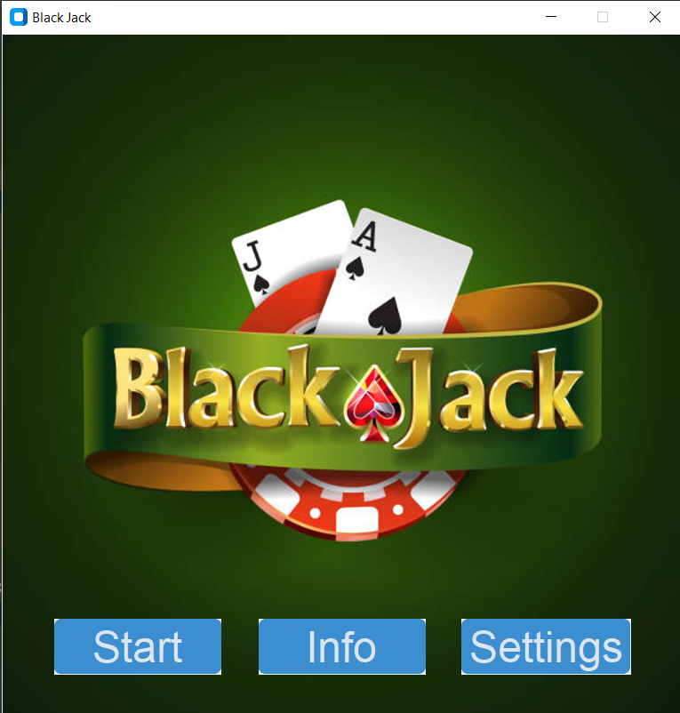
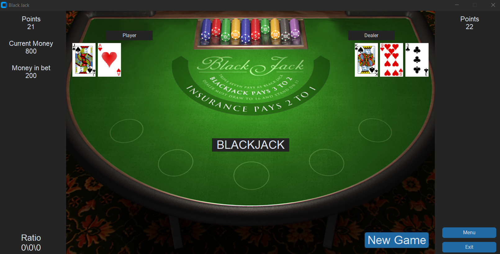
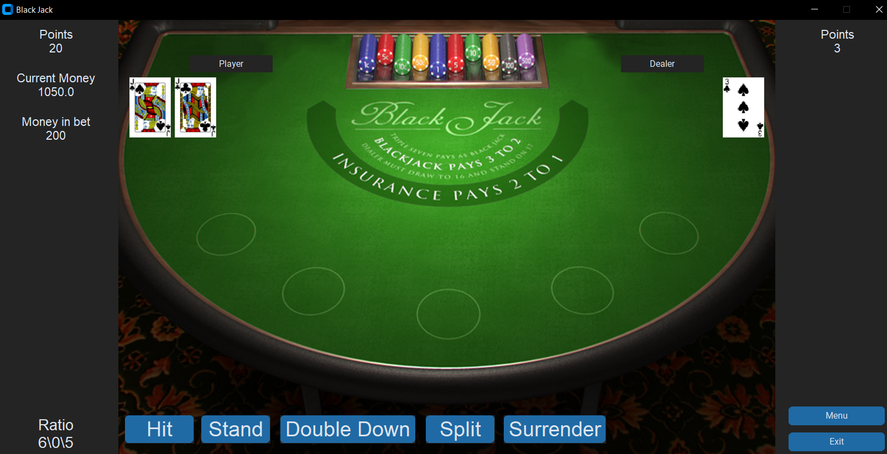
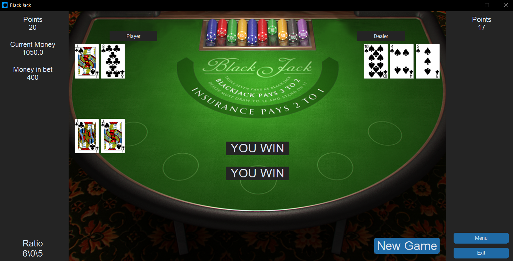
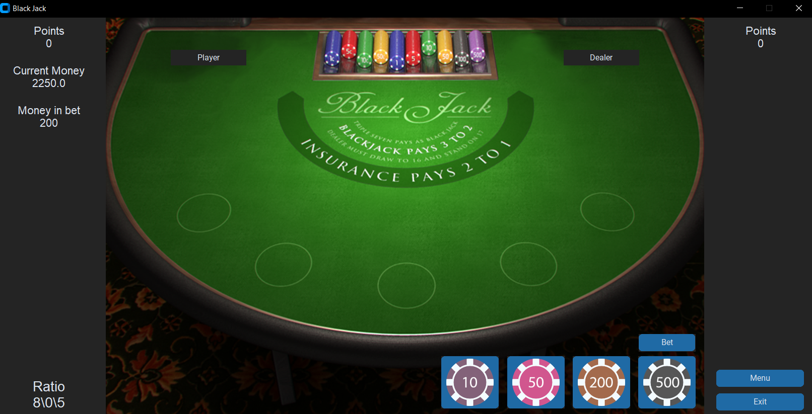

# BlackJack GAME

This is a simple BlackJack game built using Python with a graphical user interface (GUI). The game provides different betting options including hit, stand, doubledown, split, and surrender.

## Installation

To install the game, you will need to have Python installed on your computer. You can download Python from the official website: https://www.python.org/downloads/.

Once you have Python installed, download or clone the source code for this game from GitHub. Then navigate to the directory containing the game files and run the following command in your terminal to install the required packages:
- pip install -r requirements.txt

## How to Play

Once you have downloaded the source code, navigate to the directory containing the game files and run the blackjack.py file. This will launch the game window where you can start playing BlackJack.

To place a bet, select one of the betting options from the buttons provided. Once you have placed your bet, the game will deal two cards to you and two cards to the dealer. Your goal is to get as close to 21 as possible without going over.

If you are dealt a BlackJack, which is a 10 and an Ace or three sevens, you will automatically win the hand. If you have a strong hand, you can choose to stand and see if the dealer can beat your score. Alternatively, you can choose to hit and receive another card to try and improve your hand.

If you have a strong hand and feel confident, you can choose to double down, which means you will double your bet and receive one more card. If you have a pair of cards with the same value, you can choose to split them into two separate hands and place a bet on each hand.

If you feel that your hand is weak, you can choose to surrender, which means you will forfeit half of your bet and end the hand.

The game continues until you run out of chips or choose to exit the game

## Betting 

At the start of each hand, you will be provided with a certain number of chips that you can use to place bets. The available betting options are:

- Hit: Request another card to try and improve your hand.
- Stand: End your turn and see if the dealer can beat your score.
- Double Down: Double your bet and receive one more card.
- Split: Split a pair of cards with the same value into two separate hands.
- Surrender: Forfeit half of your bet and end the hand.

## Acknowledgments

This game was built as a fun project to practice Python programming and GUI development. Special thanks to the Python community for creating and maintaining the language, as well as the libraries used in this game.

## License

This project is licensed under the MIT License - see the LICENSE.md file for details.

Hope this helps! Good luck with your BlackJack game.

## Screenshots

